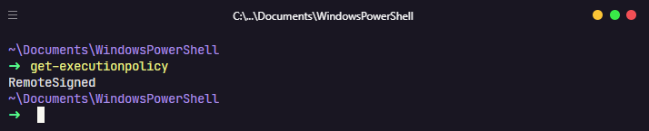

# 🔥 My Powershell Config

Configuração do meu Windows Powershell usando oh-my-posh e PSReadline

## Pré-requisitos

⚠ **Você deve usar um terminal moderno** como Hyper, Terminus, ConEmu ou o terminal oficial do Windows para ter uma boa experiência no Windows. ⚠

## Tecnologias usadas

- [oh-my-posh](https://github.com/JanDeDobbeleer/oh-my-posh)
- [PSReadline](https://github.com/PowerShell/PSReadLine)

## Como ativar a politica de execução de scripts no Powershell?

- Esse comando vai mostrar qual politica está ativa no momento:
```ps1
Get-ExecutionPolicy
```

---

**Tabela de políticas**

| Restriced                                                                               | AllSigned                                                                    | RemoteSigned                                         | Unrestriced                                                                                                            | ByPass                                           |
| --------------------------------------------------------------------------------------- | ---------------------------------------------------------------------------- | ---------------------------------------------------- | ---------------------------------------------------------------------------------------------------------------------- | ------------------------------------------------ |
| Nenhum script pode ser executado e o Powershell só executa comandos no modo interativo. | Somente scripts assinados por uma autoridade confiável podem ser executados. | Scripts baixados da internet precisam ser assinados. | Nenhuma restrição, qualquer script pode ser executado, scripts da internet virão com avisos antes de serem executados. | Nenhum script é bloqueado e nem exibidos avisos. |

<br>

Exemplo: Meu Powershell está usando a politica **RemoteSigned**



---

- Utilize este comando para ativar a execução de scripts:
```ps1
Set-ExecutionPolicy -Scope CurrentUser
```

### Como instalar PSReadline e oh-my-posh

- Instala PSReadline
```ps1
Install-Module -Name PSReadLine -AllowPrerelease -Scope CurrentUser -Force -SkipPublisherCheck
```

- Instala oh-my-posh
```ps1
Install-Module oh-my-posh -Scope CurrentUser
```

(Não necessário)
- Instala o Get-ChildItemColor
```ps1
Install-Module -Name Get-ChildItemColor -AllowPrerelease -Scope CurrentUser -Force -SkipPublisherCheck -AllowClobber
```

### Configurar o perfil do Powershell

- Dentro do powershell, execute este comando:
```ps1
if (!(Test-Path -Path $PROFILE )) { 
    New-Item -Type File -Path $PROFILE -Force 
}

# Para abrir no VSCode, mas você pode mudar.
code $PROFILE
```

### <a href="../theme/profile.ps1">Copie e cole o código na pasta theme</a>
