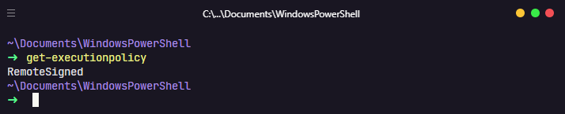

<div align="center">

</div>

<div align="center">

# 🔥 My Powershell Config

My Windows Powershell configuration with **oh-my-posh** and **PSReadline**.

</div>

<div align="center">


</div>

---

<div align="center">
  - <a href="./.github/README-pt.md">Switch to Portuguese 🇧🇷
  </a>
</div>

---

## Prerequisites
⚠**You should use a modern console** host like ConEmu, Alacritty, Terminus, Hyper, FluentTerminal, or the official Windows Terminal to have a great terminal experience on Windows. ⚠


## Techologies used

- [oh-my-posh](https://github.com/JanDeDobbeleer/oh-my-posh)
- [PSReadline](https://github.com/PowerShell/PSReadLine)

## How to active the scripts execution in Powershell?

```
# This command will show which policy is active

$ Get-ExecutionPolicy
```
---

**Policy table**
| Restriced | AllSigned | RemoteSigned | Unrestriced | ByPass |
|-------------------------------------------------------------------------------- |----------------------------------------------------- |-------------------------------------------------------------------------------- |----------------------------------------------------------------------------------------------------------- |------------------------------------------------------ |
| No script can be run. Windows Powershell can only be used in interactive mode. | Only scripts signed by a trusted publisher can run. | Download scripts must be signed by a trusted publisher before they can be run. | No restrictions. All scripts can be run, but download scripts will prompt for permission before it runs. | All scripts can be run, without warnings or prompts. |

---

Example: My Powershell is using RemoteSigned policy



```
# This command will change your policy

$ Set-ExecutionPolicy -Scope CurrentUser
```

### How to install PSReadline and oh-my-posh

```
> Install PSReadline

$ Install-Module -Name PSReadLine -AllowPrerelease -Scope CurrentUser -Force -SkipPublisherCheck
```

```
> If you don't have an -AllowPrerelease flag, upgrade PowerShellGet with: 

$ Install-Module -Name PowerShellGet -Force first.
```

```
> Install oh-my-posh

$ Install-Module posh-git -Scope CurrentUser
$ Install-Module oh-my-posh -Scope CurrentUser
```

```
> Install Get-ChildItemColor

$ Install-Module -Name Get-ChildItemColor -AllowPrerelease -Scope CurrentUser -Force -SkipPublisherCheck -AllowClobber
```

### Configure Powershell profile

```
> Into your powershell, execute this command:

$ if (!(Test-Path -Path $PROFILE )) { New-Item -Type File -Path $PROFILE -Force }
notepad $PROFILE 
```

<a href="/theme/profile.ps1"> And copy and paste profile configuration in theme</a>
