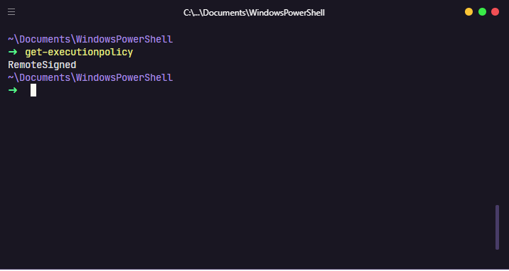

# my-powershell-config

My Windows Powershell configuration with oh-my-posh and PSReadline.

<div align="center">
  - <a href="./.github/README-pt.md">Switch to Portuguese 🇧🇷
  </a>
</div>

---

## Techologies used

- [oh-my-posh](https://github.com/JanDeDobbeleer/oh-my-posh)
- [PSReadline](https://github.com/PowerShell/PSReadLine)

## How to active the scripts execution?

```
# This command will show which policy is active

$ Get-ExecutionPolicy
```

---

**Policy table**
| Restriced | AllSigned | RemoteSigned | Unrestriced | ByPass |
|-------------------------------------------------------------------------------- |----------------------------------------------------- |-------------------------------------------------------------------------------- |----------------------------------------------------------------------------------------------------------- |------------------------------------------------------ |
| No script can be run. Windows Powershell can only be used in interactive mode. | Only scripts signed by a trusted publisher can run. | Download scripts must be signed by a trusted publisher before they can be run. | No restrictions. All scripts can be run, but download scripts will prompt for permission before it runs. | All scripts can be run, without warnings or prompts. |

---

I'm using RemoteSigned policy:



```
# This command will change your policy

$ Set-ExecutionPolicy -Scope CurrentUser
```

### How to install PSReadline and oh-my-posh

```
> Install PSReadline

$ Install-Module -Name PSReadLine -AllowPrerelease -Scope CurrentUser -Force -SkipPublisherCheck
```

```
> Install oh-my-posh

$ Install-Module posh-git -Scope CurrentUser
$ Install-Module oh-my-posh -Scope CurrentUser
```

### Configure profile

```
> Into your powershell execute this command:

$ if (!(Test-Path -Path $PROFILE )) { New-Item -Type File -Path $PROFILE -Force }
notepad $PROFILE
```

<a href="/settings/theming.psm1"> And copy profile configuration in settings</a>
